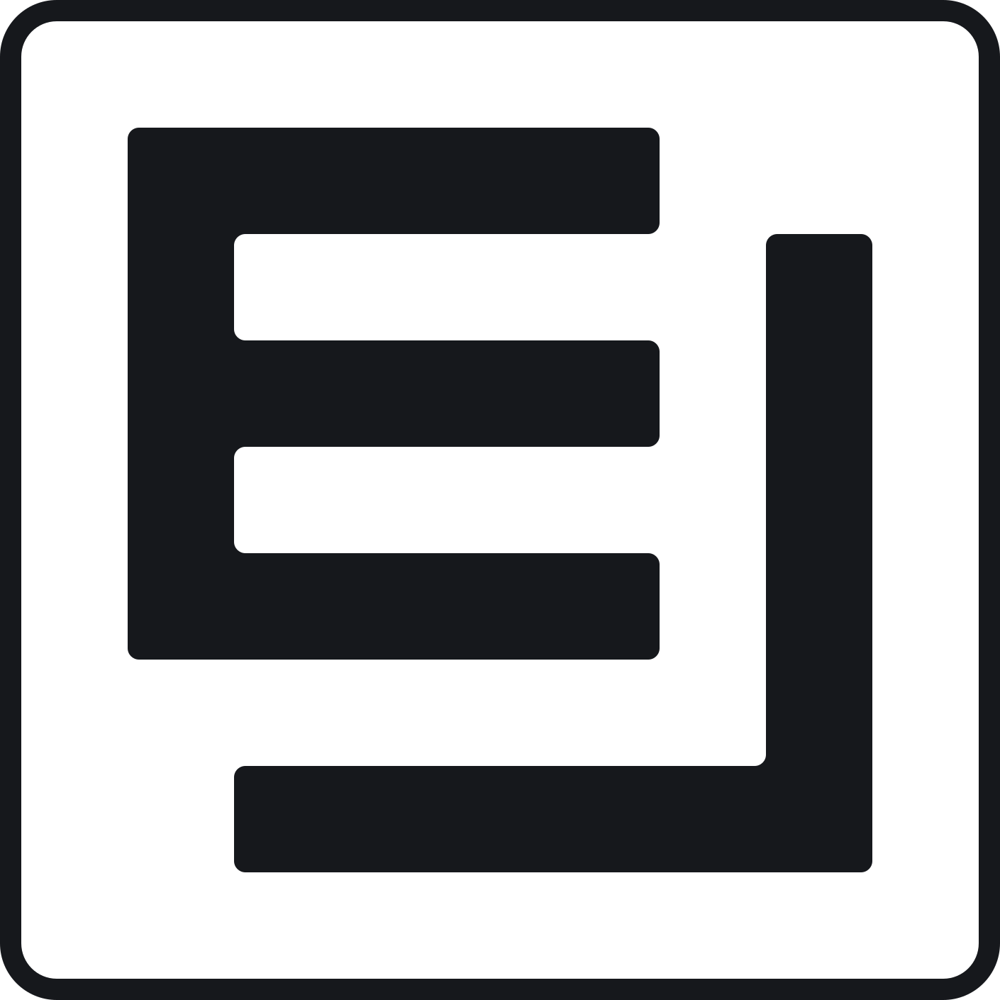
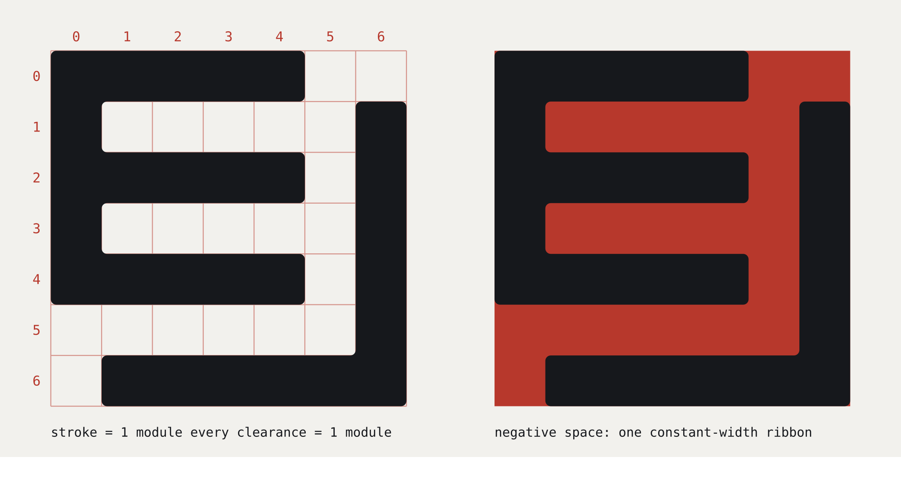
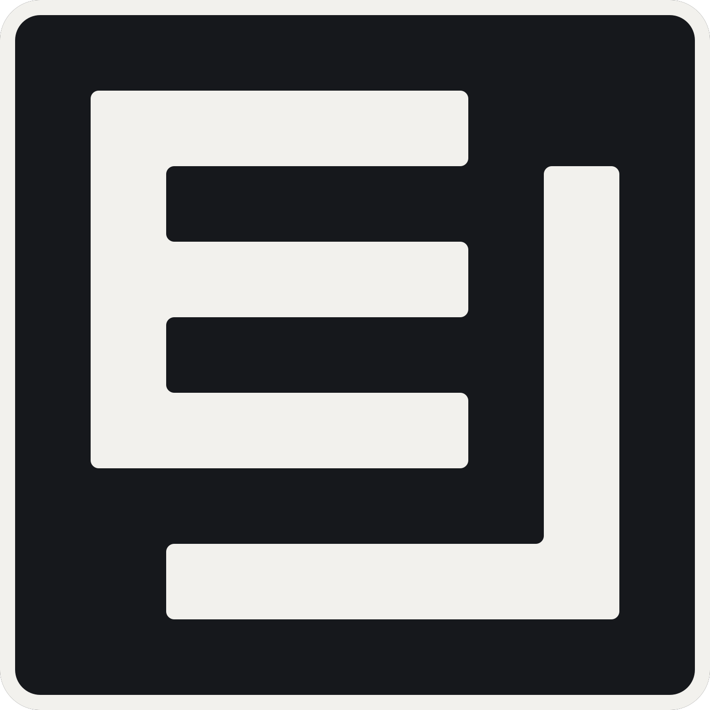
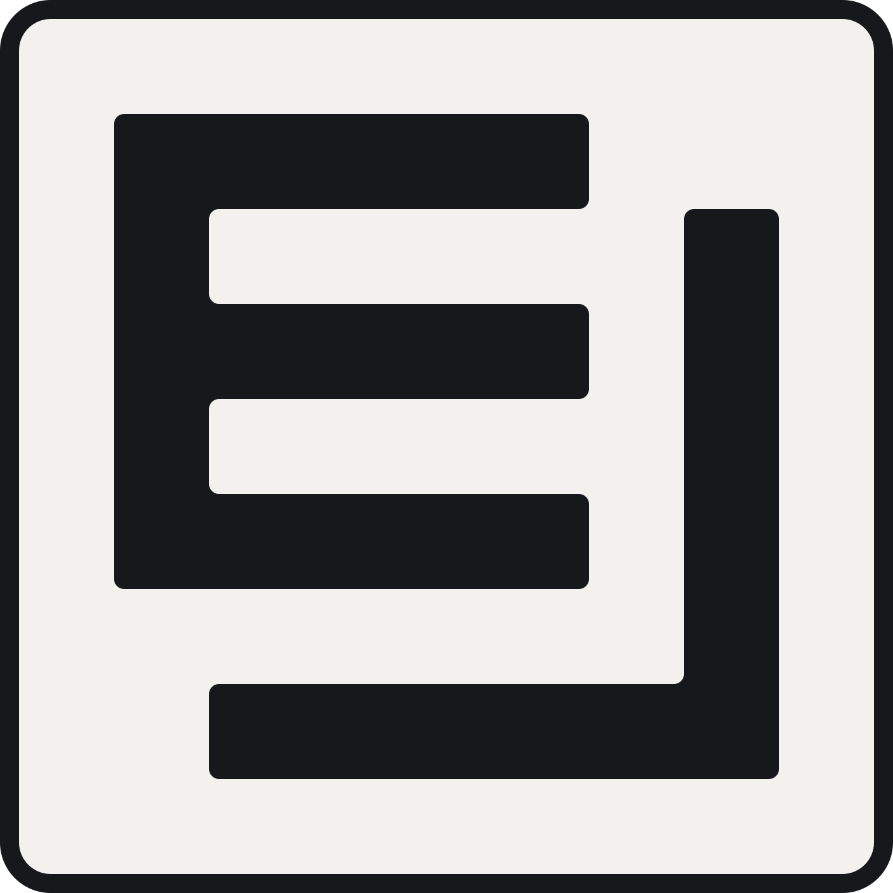
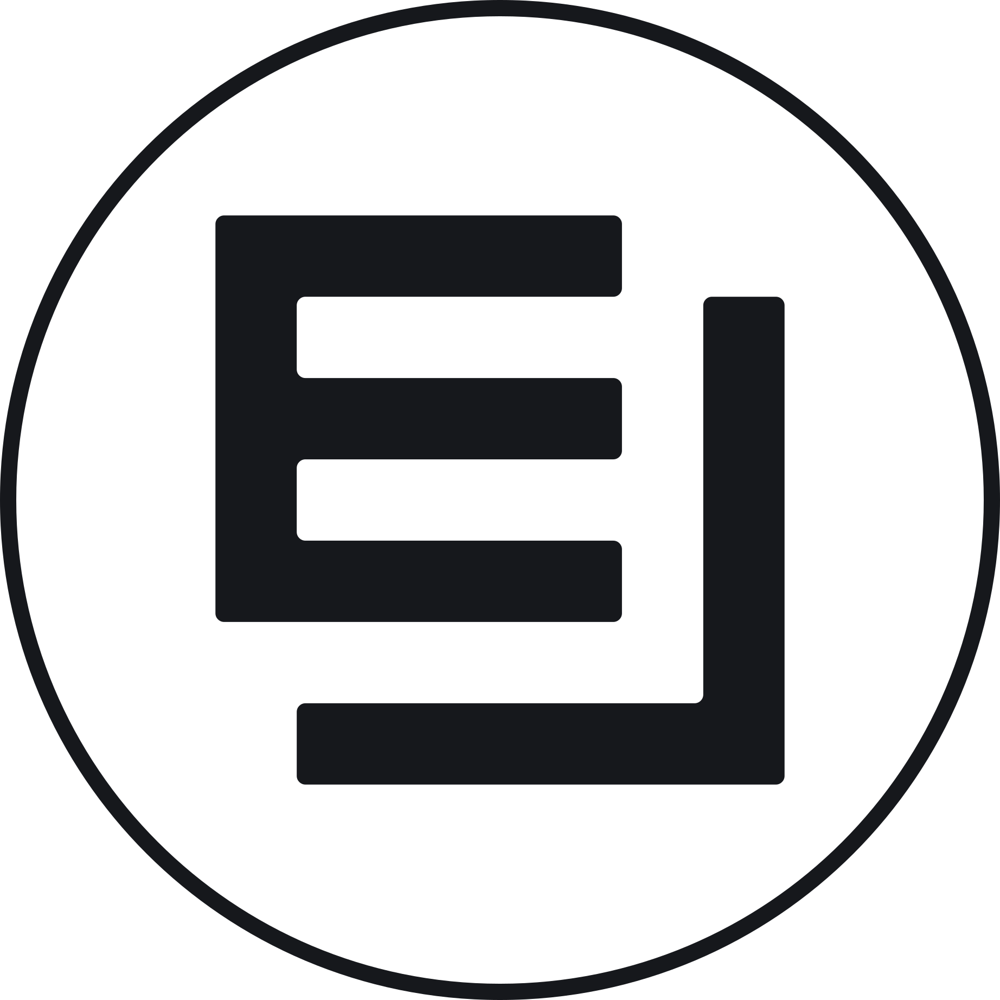

# EntropyLex — Logo Design

<p align="center">
  <picture>
    <source media="(prefers-color-scheme: dark)" srcset="entropylex-mark-bordered-inverse-blackflood.svg">
    
  </picture>
</p>

<!--
  Renderer note: every image in this document is a self-contained variant, or a
  <picture> pair that swaps on prefers-color-scheme. Do NOT embed the adaptive
  or the transparent variants here. Markdown renderers — GitHub included — load
  an  in an isolated document where fill="currentColor" has nothing to
  inherit from, so it resolves to black and vanishes on a dark theme; a
  transparent ink mark vanishes there for the same reason. GitHub supports
  <picture> with prefers-color-scheme, which is why the pairs below work.
-->

All image paths below are relative to this file; the document assumes it sits
alongside the asset set.

## 1. Introduction

EntropyLex is a bijective transcoder: arbitrary bytes in, pronounceable words
out, and the same bytes back again. Nothing is added or lost, and the
operation runs in both directions. Any mark that works for it has to carry
three ideas at once — **binary data**, **reversibility**, and **language**,
without landing in the visual clichés of the crypto category (chain links,
hexagons, glowing nodes, isometric cubes, padlocks).

## 2. Where the form came from

The work started as an attempt to draw a *square wave*, a serial byte stream as it
looks on a scope. Several iterations pursued that literally, as two combs
meshing across a channel of constant width. The result read as a machined slab
with a slit in it, and it degraded badly at avatar and favicon sizes.

The Eureka came from noticing the wave sort of looked like the arms of an E letters.
A capital **E** is already a square wave: stem, arm, gap, arm, gap, arm. Set a
mirrored **L** beside it at exactly one stroke width, and the wave completes itself.
The white channel between the two letters becomes the trace, and the E's counters
become its pulses. Also, a strong attempt was made to avoid looking like Enron.

## 3. Construction

Everything sits on a **7 × 7 grid of one module, `a`.** At the shipping scale
`a = 150`, so the unbordered glyph is 1050 × 1050.

```
      col 0   1   2   3   4   5   6
row 0  ███ ███ ███ ███ ███          ← E top arm
row 1  ███                     ███  ← E counter · channel · L stem
row 2  ███ ███ ███ ███ ███     ███  ← E middle arm
row 3  ███                     ███
row 4  ███ ███ ███ ███ ███     ███  ← E bottom arm
row 5                          ███  ← clearance row
row 6      ███ ███ ███ ███ ███ ███  ← L foot
```

| Element | Occupies |
| --- | --- |
| E stem | column 0, rows 0–4 |
| E arms | rows 0, 2, 4 — columns 0–4 |
| E counters | rows 1 and 3, one module tall |
| Vertical clearance | column 5, full height |
| L stem | column 6, rows 1–6 |
| Horizontal clearance | row 5 |
| L foot | row 6, columns 1–6 |



*Left: the grid, with columns and rows numbered as above. Right: the same mark
with the negative space flooded in seal red, which is the clearest way to see
that every piece of whitespace is one module wide.*

Stroke weight is exactly one module. So is every clearance. This is very rigid, and it
makes it possible to execute as ASCII art grid, even.

### Why the L is mirrored, not rotated

Both letters are bottom-weighted: an upright E's bottom arm and an upright L's
foot compete for the same row. Also, if the L fits below and left of the E, you
want to read the L first in left-to-right reading order. Rotating the *E* is not
an option — E is symmetric about its horizontal axis, so a 180° rotation just
produces a backwards `Ǝ`, which reads as a gimmick. Rotating the *L* 180° puts
its foot at the top, which stops reading as a letter at all.

Mirroring the L horizontally solves it. The foot stays at the bottom of its
stem, where the eye expects it, and the letter moves to the right and bottom
edges, wrapping the E rather than colliding with it, and still putting it to the
right of the E in Latin reading order.

### The open ends

The L is short by one module at both open ends: its stem begins at row 1, its
foot at column 1. This is what makes the negative space a path rather than
a slot. Traced from the top, the ribbon enters at the right edge on row 0,
turns down the channel, pulses twice to the left through the E's counters,
turns along row 5, and exits at the bottom edge on column 0.

Entry and exit sit 180° apart. A stream passes through the mark and comes out
the other side unchanged — which is the encoding, stated as a shape. The red
panel of the construction sheet above traces this directly: the ribbon is one
connected figure, not a set of gaps.

Also, the notch formed by the corner gaps makes it feel slightly 3D isometric.

### Corner treatment

The letterforms carry a 16-unit fillet, roughly 11% of the module. Sharp
corners read as brittle at display size; anything past ~30 goes soft and toylike.

The frame uses a larger fillet on purpose. The letters' literal 16 units
was tried first and reads as a *sharp* corner at frame scale, because roundness
is judged against the size of the shape it sits on, not in absolute units. The
frame's inner edge uses `a/3` (50) and its outer edge `a/3 + b` (80), which
makes the band a true parallel offset.

## 4. The border system

<p align="center">
  <picture>
    <source media="(prefers-color-scheme: dark)" srcset="entropylex-mark-bordered-inverse-blackflood.svg">
    
  </picture>
</p>

| Property | Value | Rationale |
| --- | --- | --- |
| Band weight | `a/5` = 30 | Thin enough never to compete with the letters; heavy enough to hold one device pixel at 48 px |
| Clear space | `a` = 150 | Same one-module rule as every internal gap. Also the clear-space rule: nothing else enters that ring |
| Inner fillet | `a/3` = 50 | Matches the letters' *apparent* roundness |
| Outer fillet | `a/3 + b` = 80 | Parallel offset of the inner |
| Framed canvas | 1410 × 1410 | 1050 glyph + 2 × (150 + 30) |

Minimum size for framed variants is 48 px. Below that the band drops under
one device pixel and the counters close up.

## 5. Colour

| Role | Value | Use |
| --- | --- | --- |
| Ink | `#16181C` | The mark. Graphite, not pure black. Also the ground of the black-flood chip |
| Paper | `#F2F1ED` | Ground. Neutral off-white — warm cream plus a saturated accent is the current generated-identity tell, and was deliberately avoided |
| Seal | `#B7382C` | Diagrams and the dictionary-fingerprint stamp only. Never on the mark itself |
| Flood white | `#FFFFFF` | Ground of the white-flood chip only, where the chip has to match a true-white surface exactly. Never the mark |

The mark is monochrome. One mark, one colour — the E and the L are never
coloured differently.

These four values are the whole palette. The black-flood chip grounds in **Ink**,
which makes it the exact inverse of the badge. An earlier hand-edited export
grounded it in `#231F20` — Illustrator's CMYK-black conversion — which put an
undeclared fifth value into the identity; it is not used anywhere.

## 6. Variants

### Vector

| File | Ground | Use |
| --- | --- | --- |
| `entropylex-mark-bordered.svg` | transparent, ink | Light backgrounds |
| `entropylex-mark-bordered-inverse.svg` | transparent, paper | Dark backgrounds |
| `entropylex-mark-bordered-adaptive.svg` | transparent, `currentColor` | Themed contexts. Inherits colour from its parent — set colour on the parent element, do **not** add a `fill` attribute |
| `entropylex-mark-bordered-whiteflood.svg` | `#FFFFFF` flood inside the border, ink mark | Self-contained light chip |
| `entropylex-mark-bordered-inverse-blackflood.svg` | ink flood inside the border, paper mark | Self-contained dark chip; the exact inverse of the badge |
| `entropylex-badge.svg` | paper flood, ink mark | Generated equivalent of the white flood |
| `entropylex-avatar-bordered.svg` | transparent, `currentColor` | Circular frame for round avatar crops, where the surface is known |
| `entropylex-avatar-bordered-whiteflood.svg` | `#FFFFFF` disc, ink mark | Circular light chip. The form an avatar upload usually needs |
| `entropylex-avatar-bordered-inverse-blackflood.svg` | ink disc, paper mark | Circular dark chip |
| `entropylex-construction.svg` | — | Spec sheet: the 7 × 7 grid, and the negative ribbon shown in seal red |

### Raster

`entropylex-mark-bordered-whiteflood.png` and
`entropylex-mark-bordered-inverse-blackflood.png` accompany their vector
sources for platforms that will not accept SVG — most social profile uploads,
some package registries, and app-store listings.

Both are 1000 × 1000 **RGBA**, rendered from the SVG of the same name:

```text
rsvg-convert -w 1000 -h 1000 entropylex-mark-bordered-whiteflood.svg \
             -o entropylex-mark-bordered-whiteflood.png
```

The alpha channel is not optional. The flood stops at the band's outer radius,
so everything beyond the rounded corners is transparent. Exported without
alpha, those corners flatten to opaque white and the *dark* chip — the one
whose entire purpose is dark surfaces — renders as a black chip with four white
wedges poking out of it. If a platform demands a matte, composite it against
that platform's known background rather than baking white into the file.

### On the flood variants

The transparent variants are correct wherever the background is known. They are
a liability wherever it is not: a transparent ink mark disappears on a dark
theme, and a transparent paper mark disappears on a light one.

<table align="center">
  <tr>
    <td align="center"></td>
    <td align="center"></td>
    <td align="center"></td>
  </tr>
  <tr>
    <td align="center"><code>whiteflood</code></td>
    <td align="center"><code>inverse-blackflood</code></td>
    <td align="center"><code>badge</code></td>
  </tr>
</table>

The flooded pair fixes this by carrying its own ground inside the border.
They are the safest choice for social avatars, README badges, conference decks,
and anything composited over photography or an unknown surface. The white
flood is the default for light-mode and unknown surfaces; the black flood is
the default for dark-mode surfaces. Where a page can switch themes at
runtime, use the adaptive variant instead and let it inherit.

One exception: the adaptive variant does **not** work when embedded as an image
in Markdown. GitHub and most other renderers load `` in an isolated
context where `currentColor` has nothing to inherit from, so it falls back to
black and vanishes on a dark theme. In Markdown, use a `<picture>` element with
`prefers-color-scheme` to swap the two flooded files instead — see the comment
at the head of this document.

Note that the flood sits *inside* the outer border, not behind it — the band
remains the outermost edge, so the mark keeps a defined silhouette against any
surface rather than fading into a rectangle.

### Circular avatar

<p align="center">
  <picture>
    <source media="(prefers-color-scheme: dark)" srcset="entropylex-avatar-bordered-inverse-blackflood.svg">
    
  </picture>
</p>

All three circular files are 1844.92 units square, with the glyph at
**≈57% of the diameter**. The circle is sized so the glyph's *corners* — not its
edges — keep one module of clear space, which is why the ratio is lower than a
square crop would use.

Prefer a flooded circular variant for an actual avatar upload. GitHub, Discord
and most other platforms composite the file against a surface you do not
control, and several re-encode it without alpha; a transparent disc is the one
form that cannot survive that intact.

## 7. ASCII versions

The mark is modular, so it transcribes to a character grid without loss. Both
files are a **9 × 9 block**: the 7 × 7 grid plus a one-character space border,
with lines padded to full width so the block stays rectangular.

`entropylex-7x7-hash-positive.txt` — solid modules:

```
 #####
 #     #
 ##### #
 #     #
 ##### #
       #
  ######
```

`entropylex-7x7-ascii-positive.txt` — box rule characters. Because the mark is
one-module rectilinear strokes, `+ - |` depicts it more faithfully than a fill:

```
 +----
 |     |
 +---- |
 |     |
 +---- |
       |
  -----+
```

Both are generated by `ascii_mark.py` from the same module definition as the
vector files, so they cannot drift out of sync with the SVGs.

**Caveat:** monospace cells are roughly 1:2, so a literal 7 × 7 renders visibly
taller than wide and the E's arms look stretched. This is fine in a source
comment or a CLI banner. For a README header, double each character
horizontally to recover near-square proportions.

## 8. Generators

| Script | Produces |
| --- | --- |
| `entropylex_mark.py` | All SVG variants, from explicit closed paths |
| `ascii_mark.py` | The character grids |

Every shipped file is generator output. Nothing in this folder is hand-edited,
and nothing should be: an editor round-trip is what previously replaced the
transparent `entropylex-mark-bordered.svg` with an opaque copy of the white
flood, swapped in an undeclared near-black, dropped the accessibility
attributes, and left 43 KB of embedded application state in each of three
files. Change the generator and re-run it.

Every **mark** variant contains no masks, no clip paths, no strokes, no live
text, and no CSS classes — only closed filled paths with a literal `fill`
attribute. That is what lets them import into CAD, laser, vinyl cutter and
embroidery software without flattening. `entropylex-construction.svg` is the
one exception and is deliberately not a mark: it is a spec sheet, and it uses
strokes for the grid and live text for the labels.

Regenerating is safe and idempotent — the assets in this folder are byte-for-byte
what the two scripts produce. `entropylex_mark.py` also writes five variants
that are not part of the shipped set (`entropylex-mark.svg`,
`-mark-closed-L.svg`, `-avatar.svg`, `-appicon.svg`, `-lockup.svg`), and
`ascii_mark.py` writes the two negative grids; those are working output, kept
untracked.

Key constants in `entropylex_mark.py`:

```python
A        = 150      # one module; stroke weight
R        = 16       # letterform fillet
B_WEIGHT = A / 5    # border band weight
B_GAP    = A        # clear space between glyph and band
B_RADIUS = A / 3    # border inner fillet
```

`letters()` takes `foot_start` and `stem_start` as row/column indices. Both
default to `1`, giving the open-ended form described above. Setting either to
`0` closes that end of the L.

## 9. Rules

1. **Never adjust one clearance without adjusting all of them.** The counters,
   the vertical channel and the horizontal channel are all one module. If any
   of them drifts, the negative space stops being a constant-width ribbon and
   the mark becomes two letters standing near each other.
2. **Never skew or italicise the E, and never add stripes to it.** That
   silhouette belongs to a bankrupt energy company and the resemblance is
   instant.
3. **Never colour the two letters differently.** One mark, one colour.
4. **Never place anything inside the clear-space ring.**
5. **Do not use a framed variant below 48 px.**
6. **Never embed the adaptive or transparent variants in Markdown.** A Markdown
   renderer loads an `` in an isolated document, so `fill="currentColor"`
   resolves to black and a transparent ink mark has nothing behind it. Both
   vanish on a dark theme. Use a self-contained variant, or a `<picture>` pair
   keyed on `prefers-color-scheme`, as this document does throughout.

### Licensing

The mark is **not** covered by the repository's MIT licence. The generator
scripts are MIT source code, but their output is the EntropyLex logo, and the
logo is a trademark of AlphaPixel LLC. Referring to the project with the
unmodified mark is fine; using it as your own identity, or altering it, is not.
See [`../../../TRADEMARKS.md`](../../../TRADEMARKS.md).

## 10. Wordmark

The lockup pairs the mark with `EntropyLex` set solid, no space. Recommended
faces are neo-grotesques with a technical undertone — Söhne, ABC Diatype, GT
America, or Suisse Int'l.

Set *Entropy* in Regular and *Lex* in Medium. The weight step across the seam
is the transcode, and it echoes the mark: two halves of one object, differing
only in how they are grouped. Cap height matches the E. Convert to outlines
with the licensed face before release.
